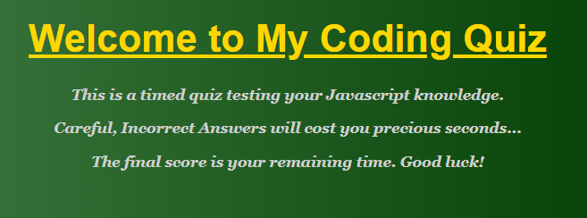
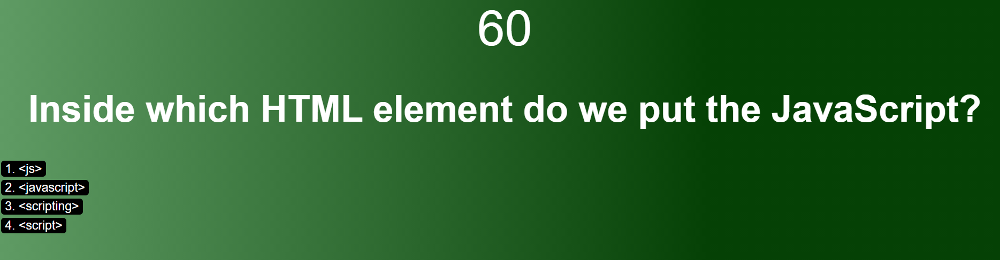
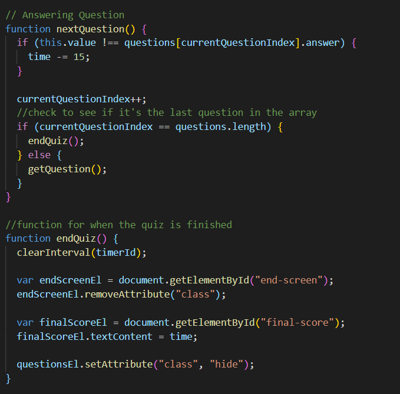
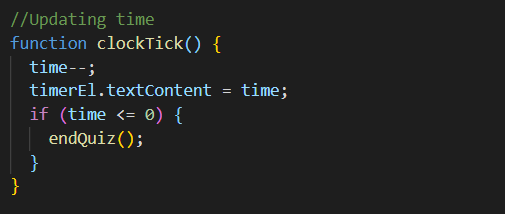
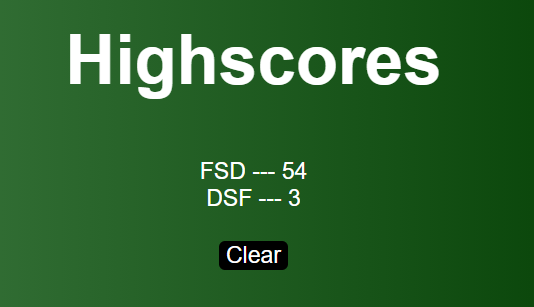
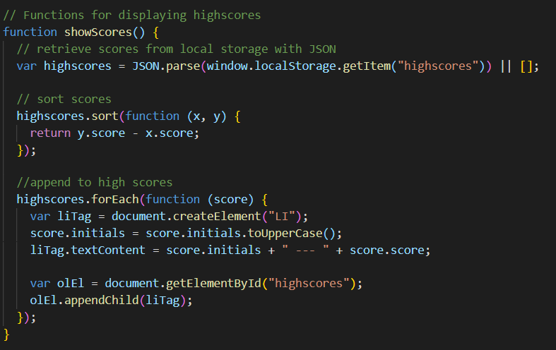
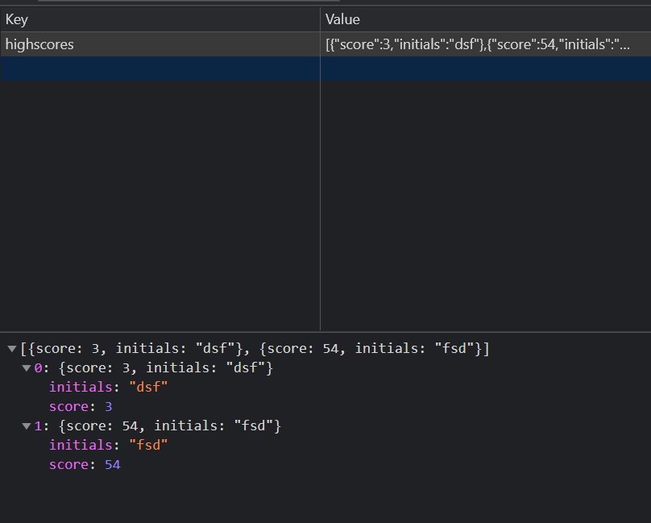
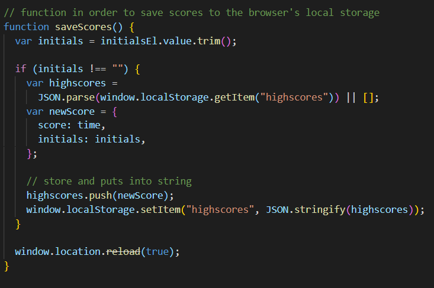

# 04 Java script.JSON: Coding Quiz (Explanation ReadMe)

Link to Website: https://crowderyan.github.io/CodingQuiz/

1.  The Quiz taking process:

    - A. Clearly stated rules:
      

    - B. Question display:

      

      

    - C. Timer display:

    

    

    - C. Score display:

      

      

2.  Local Storage manipulation:

